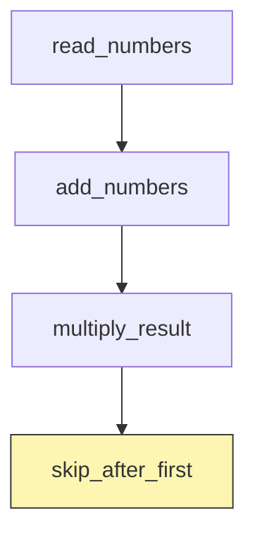

# File-driven Airflow + Fast-MCP — Minimal Working Design

A **single JSON file** defines the entire DAG; a tiny factory script turns that spec into an Airflow DAG at parse-time.  
`MCPCallOperator` executes Fast-MCP tools, auto-casts string numerals/booleans, and supports a `"run_once": true` flag that skips the task after its first successful run.

The following is a minimal working design for the integration of Airflow and Fast-MCP. 

---

## Folder layout
```
airflow_playground/
├─ dags/
│  └─ dag_factory.py          # JSON → DAG builder
├─ plugins/
│  └─ operators/mcp_call.py   # Fast-MCP operator with run-once logic
├─ specs/
│  └─ demo_math.json          # pipeline definition
├─ src/
│  └─ math_server.py          # add, multiply, should_be_skipped
└─ config/
   └─ numbers.json            # {"a": 6, "b": 4}
```

---

## `demo_math.json` (spec file)

```json
{
  "dag_id": "demo_math",
  "start_date": "2025-01-01T00:00:00Z",
  "schedule": null,

  "tasks": [
    {
      "task_id": "read_numbers",
      "operator": "python_fn",
      "python_callable": "read_config",
      "params": {
        "file": "config/numbers.json"
      }
    },
    {
      "task_id": "add_numbers",
      "operator": "MCPCallOperator",
      "module_path": "src.mcp_servers.test_mcp",
      "tool_name": "add",
      "tool_args": {
        "a": "{{ ti.xcom_pull('read_numbers')['a'] }}",
        "b": "{{ ti.xcom_pull('read_numbers')['b'] }}"
      },
      "depends_on": ["read_numbers"]
    },
    {
      "task_id": "multiply_result",
      "operator": "MCPCallOperator",
      "module_path": "src.mcp_servers.test_mcp",
      "tool_name": "multiply",
      "tool_args": {
        "a": "{{ ti.xcom_pull('add_numbers') }}",
        "b": "{{ ti.xcom_pull('read_numbers')['b'] }}"
      },
      "depends_on": ["add_numbers"]
    },
    {
      "task_id": "skip_after_first",
      "operator": "MCPCallOperator",
      "module_path": "src.mcp_servers.test_mcp",
      "tool_name": "should_be_skipped",
      "tool_args": {
        "a": "{{ ti.xcom_pull('read_numbers')['a'] }}",
        "b": "{{ ti.xcom_pull('read_numbers')['b'] }}"
      },
      "depends_on": ["multiply_result"],
      "run_once": true
    }
  ]
}
```

---

## `MCPCallOperator` (core logic)

```python
var_key = f"run_once__{context['dag'].dag_id}__{self.task_id}"
if self.run_once and Variable.get(var_key, default_var=None):
    raise AirflowSkipException()

payload = _auto_cast(self.tool_args)          # "4"→4, "true"→True, etc.
result  = await Client(server).call_tool(self.tool_name, payload)

if self.run_once:
    Variable.set(var_key, "done")
return result.content[0].text                 # pushed to XCom
```

---

## `dag_factory.py` (essential loop)

```python
for spec_file in SPEC_DIR.glob("*.json"):
    dag_spec = json.loads(spec_file.read_text())
    with DAG(dag_spec["dag_id"], start_date=pendulum.parse(dag_spec["start_date"]), schedule=dag_spec.get("schedule"), catchup=False, tags=["dynamic"]) as dag:
        task_map = {}
        for t in dag_spec["tasks"]:
            if t["operator"] == "python_fn":
                task_map[t["task_id"]] = airflow_task(task_id=t["task_id"])(lambda p=t["params"]: PY_FN_REGISTRY[t["python_callable"]](**p))()
            else:
                task_map[t["task_id"]] = MCPCallOperator(task_id=t["task_id"], module_path=t["module_path"], tool_name=t["tool_name"], tool_args=t["tool_args"], run_once=t.get("run_once", False))
        for t in dag_spec["tasks"]:
            for up in t.get("depends_on", []):
                chain(task_map[up], task_map[t["task_id"]])
    globals()[dag.dag_id] = dag
```

---

## Run-once flow



*First DAG run:* `skip_after_first` executes → Variable written.  
*Later runs:* operator sees Variable → raises `AirflowSkipException` → task status **SKIPPED**.


## Wishlist

### 0. A centralised repository/mapping for looking up module_path according to tool names. 

### 1. A script based alignment between the Task Decomposition results and the DAG spec should be created. 

### 2. A LLM agent that figures out which steps should be "run_once" should be created. 

### 3. A LLM agent that adjusts the xcom push and pull should be created, and a script based validation tool should be created to validate the xcom push and pull consistency. Forming a closed loop that can be used to iteratively improve the DAG spec. 

### 4. [Future] A RAG mechanism to search for existing DAG for similar tasks should be created. 

