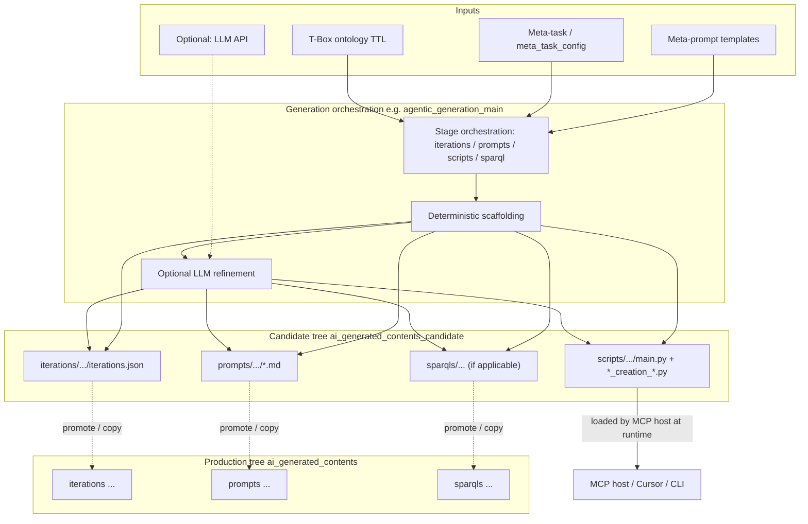
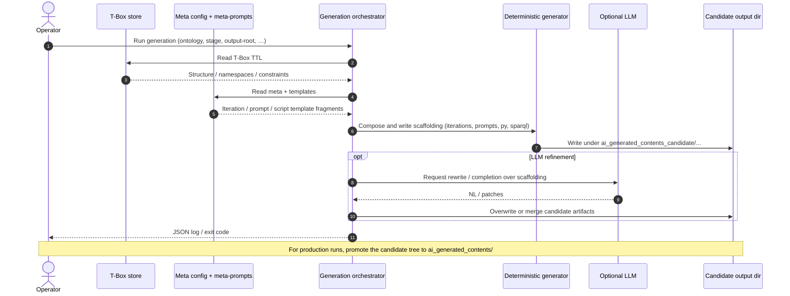
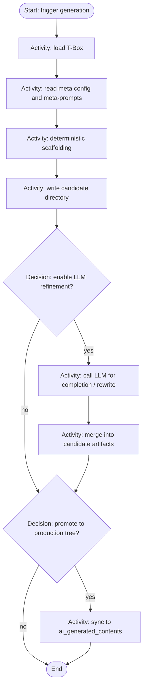
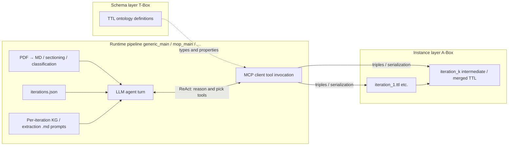
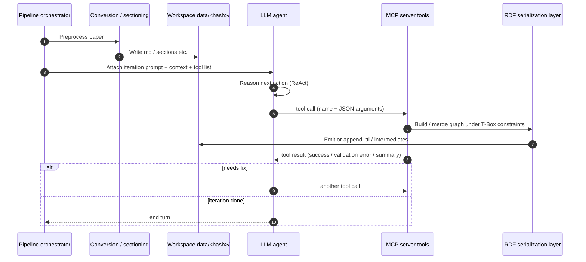
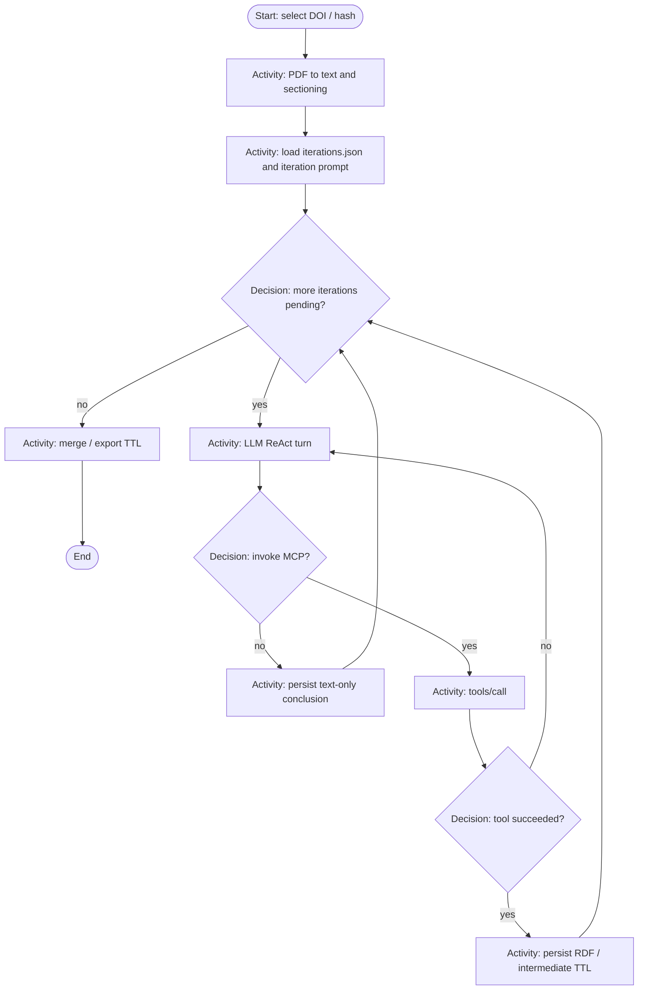
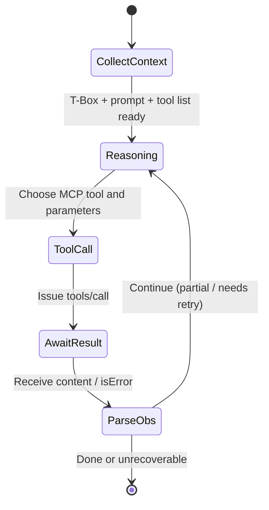

# MCP-enhanced knowledge graph workflows — UML in Mermaid

This document uses **Markdown + Mermaid** for three topics: (1) **generation flow** for prompts and scripts; (2) **how the KG is built at runtime**; (3) **Agent–MCP interaction** in this repo (including ReAct and MCP I/O).

For each topic there are two views:

- **Structure / mechanism** (how it works: responsibilities, artifacts, data flow).
- **Sequence / ordering** (same spirit as your **sequence diagram**; in Mermaid, `sequenceDiagram` shows message order between participants).

---

## 1. Generation flow: prompts and MCP scripts

### 1.1 Inputs and outputs (narrative)

| Direction | Artifact / data | Description |
|-----------|-----------------|-------------|
| **Input** | Domain **T-Box** (TTL, etc.) | Classes, properties, namespaces; used as generation context. |
| **Input** | **Meta-task config** (e.g. `meta_task_config.json`) | Ontology roles, extensions, generation stages. |
| **Input** | **Meta-prompts** (`ape_generated_contents/meta_prompts/...`) | Tell the LLM or templates how to assemble extraction / KG-building / MCP-script prompts. |
| **Input** | (Optional) **LLM** | e.g. `--llm-agent-generation` for semantic refinement of scaffolding. |
| **Output** | `iterations.json` | What runs each iteration; which prompt templates and paths. |
| **Output** | **`.md` prompts** for extraction / KG building | Consumed by the pipeline at runtime. |
| **Output** | **MCP Python server** (`main.py`, `*_creation_*.py`, …) | Exposes T-Box-aligned graph-building functions as MCP tools. |
| **Output** | (Often) **SPARQL** (e.g. `top_entity_parsing.sparql`) | First-step entity scoping, etc. |
| **Default layout** | `ai_generated_contents_candidate/` → promote to `ai_generated_contents/` | Candidate vs production layout: see `src/agents/scripts_and_prompts_generation/README.md`. |

### 1.2 Structure view: how generation works (components and data flow)

Component-style flow showing responsibilities and main data sinks (subgraphs compress “swimlane” ideas).



### 1.3 Sequence view: message order for generation

This is the User / T-Box → orchestrator → artifacts ordering. It is analogous to a “Creation / Integration” split in high-level diagrams; here the repo folds that into **one entrypoint with multiple stages**.



### 1.4 UML activity diagram: generation control structure

Unlike **§1.3**, this stresses **decisions and branches** (LLM on/off, promotion), closer to classic activity diagrams.



---

## 2. Knowledge graph build pipeline (runtime)

### 2.1 Inputs and outputs (narrative)

| Direction | Artifact | Description |
|-----------|----------|-------------|
| **Input** | PDF (`raw_data/<doi>.pdf`, …) | Full paper. |
| **Input** | **`iterations` + prompts + sparql** under `ai_generated_contents/` | Iteration definitions and prompts. |
| **Input** | **MCP config** (`configs/mcp_configs.json`) | How each ontology’s MCP server is launched. |
| **Input** | **MCP tool implementation** from the generation phase | e.g. per-ontology `main.py`. |
| **Output** | **Multi-iteration TTL**, intermediates, `mcp_run*` under `data/<doi_hash>/` | Main + extension RDF; A-Box grows per iteration. |
| **Output** | (Optional) **Grounded**, normalized TTL | Mapped to a reference KG. |

### 2.2 Structure view: how the KG is assembled

**T-Box constraints + A-Box assertions** at runtime: MCP tools implement ontology-aligned writers; the pipeline drives LLM + tools in stages via **iterations.json**.



### 2.3 Sequence view: typical ordering within an iteration (simplified paper pipeline)

Iteration names and counts follow `iterations.json`; the diagram abstracts the cadence **prepare → prompt → tool writes TTL → persist**.



### 2.4 UML activity diagram: control flow for one paper’s KG build

Outer loop over **iterations**, inner loop of **ReAct + MCP** within an iteration; exact iteration ids come from `iterations.json`.



---

## 3. Agent–MCP interaction: ReAct, I/O, and error loop

### 3.1 MCP I/O (abstract)

| MCP direction | Payload | Description |
|---------------|---------|-------------|
| **Host → Server** | `tools/list` (implicit or at startup) | Agent learns tool names, JSON Schema, descriptions. |
| **Host → Server** | `tools/call`: `name` + `arguments` | One atomic call; arguments must match schema (instance fields, IRIs, literals, …). |
| **Server → Host** | `content` (text / resource refs) + `isError` | Success: status summary, paths, triple counts, …; failure: `isError: true` and message. |
| **Agent** | Observation | Fed back into ReAct context for the next Thought / Action. |

### 3.2 UML: ReAct loop + MCP request/response (sequence)

```mermaid
sequenceDiagram
  autonumber
  participant Ctx as Context<br/>(T-Box digest / iteration prompt / history)
  participant Thought as Thought
  participant Action as Action
  participant MCPIn as MCP tools/call args
  participant Server as MCP server<br/>(Python tool impl)
  participant Obs as Observation

  Ctx->>Thought: User goal + visible triple state
  Thought->>Action: Chosen tool name + JSON parameters
  Action->>MCPIn: name, arguments (schema validated)
  MCPIn->>Server: JSON-RPC / MCP transport
  Server->>Server: Run create_* / link_* etc.; write in-memory graph or files
  Server-->>Obs: structuredContent or text (ok) / isError (failure)
  Obs->>Ctx: Append to message history
  Thought->>Thought: Revise plan on error, else finish or continue
```

### 3.3 Structure view: ReAct state vs MCP boundary (state machine)



---

## 4. Worked example — medical operative text → RDF instances (ReAct + MCP retry)

This section is a **concrete narrative** aligned with:

- A real output shape under `data/ec5d5219/medical_output/Fallnummer_123456789_OP-Datum_20.01.2026_explicit_Fallnummer_and_OP_episode_evidence.ttl` (patient id, OP date, team literals, diagnosis flags, etc.).
- The repo pattern: an **LLM agent** iterates in **ReAct** style; the **medical MCP server** (generated under `ai_generated_contents/.../scripts/medical/`, names vary per generation) exposes **ontology-shaped** tools such as `create_*` and `link_*` that append to the in-memory / exported RDF graph.

Exact tool identifiers and parameter keys follow the **JSON Schema** published by your generated server; the names below are **illustrative** but match the ontology fields you see in that TTL (`PatientInfo.Fall_Nr`, `CaseTimeline.OP_Datum`, `SurgicalTeam.Operateur_in`, …).

### 4.1 Source text (excerpt)

Imagine the pipeline has already turned a PDF into markdown; the **KG-building iteration** receives a short German operative note span like:

```text
Patient: Hans Müller — Fallnummer 123456789.
OP-Datum: 20.01.2026.
Team: Operateur_in Arzt Eins, Assistent_in Arzt Zwei.
Befund / Diagnose: NSCLC; sonst Pleuraadhäsionen.
Pathologie: R0.
```

The agent’s **system prompt + iteration template** instruct it to materialize a `MedicalCase` shell (often scoped to a top entity from an earlier iteration) and to fill **linked** nodes: `PatientInfo`, `CaseTimeline`, `SurgicalTeam`, `Diagnosis`, `PathologyOutcome`, …

### 4.2 End-to-end flow (compact)

1. **Pipeline** loads `iterations.json` for ontology `medical`, attaches this text + prior graph summary + **tool list** from MCP (`tools/list`).
2. **Thought**: “I need a timeline node with OP date, then patient demographics; fix any validation errors the server returns.”
3. **Action 1 — failing call**: Agent calls a tool (illustrative name) `create_case_timeline` but supplies the date in **ISO** form because the model hallucinates the wrong convention.

   ```json
   {
     "medical_case_iri": "https://www.theworldavatar.com/kg/instance/MedicalCase/3327945311c2debbc61673308553d17f560645f2",
     "op_datum": "2026-01-20"
   }
   ```

4. **Observation (error)**: The MCP layer validates against the **ontology-driven** tool schema (or runtime guard) and returns something like: `isError: true`, message *`OP_Datum must match ward chart style DD.MM.YYYY`* or *`Unknown field op_datum; expected OP_Datum`* — depending on how strictly the generated server maps OWL datatype annotations to argument names.

5. **Thought (retry)**: Agent reads the error text, aligns with the snippet `OP-Datum: 20.01.2026.`

6. **Action 2 — corrected call**:

   ```json
   {
     "medical_case_iri": "https://www.theworldavatar.com/kg/instance/MedicalCase/3327945311c2debbc61673308553d17f560645f2",
     "OP_Datum": "20.01.2026"
   }
   ```

7. **Observation (success)**: Server returns the new **instance IRI** (example from your TTL):

   `https://www.theworldavatar.com/kg/instance/CaseTimeline/2f4425a386eb9bce4220d436b72f579b6adb0090`

   and the graph now contains:

   ```turtle
   ns1:CaseTimeline/2f4425a3… a ns1:CaseTimeline ;
       ns1:OP_Datum "20.01.2026" ;
       ns1:type "med:CaseTimeline" .
   ```

   (plus `medical:hasTimeline` from the case — often a second `link_*` tool.)

8. **Action 3 — second tool with one retry**: Agent targets patient demographics. A first call uses a **near-miss key** (e.g. `Fall_Label` instead of `Fall_Nr`) and receives **`isError`**. After reading the tool schema / error text, the agent retries with the scoped case IRI:

   ```json
   {
     "medical_case_iri": "https://www.theworldavatar.com/kg/instance/MedicalCase/3327945311c2debbc61673308553d17f560645f2",
     "Fall_Nr": "123456789",
     "Name": "Hans Müller"
   }
   ```

   **Observation**: Success — instance `…/PatientInfo/2b9725f8…` with `ns1:Fall_Nr "123456789"` and `ns1:Name "Hans Müller"`, matching the published TTL.

9. **Pipeline persistence**: When the turn ends, the orchestrator **serializes** the graph (export / `medical_output` / `memory` TTL depending on step config), producing the file you inspected on disk.

### 4.3 Sequence diagram — think → wrong tool args → error → retry → success → second tool

```mermaid
sequenceDiagram
  autonumber
  participant Pipe as Pipeline (medical iter)
  participant LLM as ReAct agent
  participant MCP as Medical MCP server

  Pipe->>LLM: User content + T-Box hints + tool schemas
  Note over LLM: Thought: extract OP date as ISO → easier for me
  LLM->>MCP: tools/call create_case_timeline{"op_datum":"2026-01-20", ...}
  MCP-->>LLM: isError: schema / ward-format mismatch (DD.MM.YYYY expected)
  Note over LLM: Thought: align with source "20.01.2026"
  LLM->>MCP: tools/call create_case_timeline{"OP_Datum":"20.01.2026", ...}
  MCP-->>LLM: OK + CaseTimeline IRI + graph delta summary
  Note over LLM: Thought: patient id + name next
  LLM->>MCP: tools/call create_patient_info{"medical_case_iri": "...MedicalCase/33279453...", "Fall_Label":"123456789","Name":"Hans Müller"}
  Note right of MCP: Wrong key: Fall_Label vs Fall_Nr
  MCP-->>LLM: isError: unknown / invalid parameter
  LLM->>MCP: tools/call create_patient_info{"medical_case_iri": "...MedicalCase/33279453...", "Fall_Nr":"123456789","Name":"Hans Müller"}
  MCP-->>LLM: OK + PatientInfo IRI
  LLM-->>Pipe: End turn; TTL writer runs
```

*(The diagram shows two realistic failure modes — **date format** and **parameter key** — before the graph matches your on-disk TTL.)*

### 4.4 What “the instance” is, in this example

After a successful turn (and export), the **same** bundle of individuals you see in `Fallnummer_123456789_…evidence.ttl` is what the agent was aiming for: one `MedicalCase` individual linked to satellite nodes whose **literal values** are grounded in the operative text. The ReAct loop’s value is visible when the **first** MCP call does not satisfy the ontology-backed contract — the agent **repairs** arguments from the error surface instead of silently emitting bad triples.

---

## Legend and how to render

- **Render**: Open this file in VS Code / Cursor, GitHub, or any Mermaid-capable Markdown preview.
- **Relation to “World Avatar” diagrams**: Those often show separate **MCP Creation** and **MCP Integration** agents; this repo merges that idea into **meta-prompts + `agentic_generation_main` orchestration**, while **§1.3** still shows the same informational sequence (read ontology → generate → persist).
- **Implementation detail**: Paths and commands are documented in `src/agents/scripts_and_prompts_generation/README.md` and `docs/Overall.md`.
